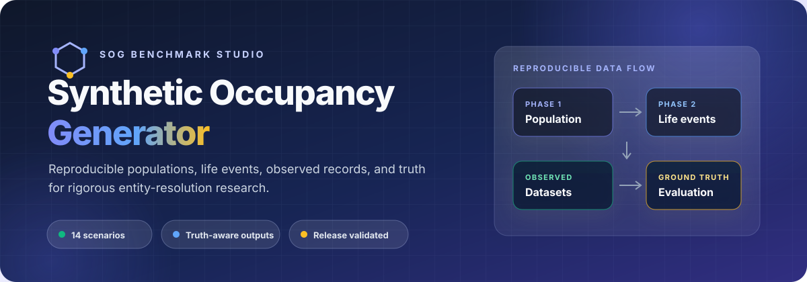

<p align="center">
  
</p>

<p align="center">
  <a href="https://github.com/MaTaha-ualr/Synthetic-Occupancy-Generator-data_pipeline/tree/paper-artifact-2026.07.24"></a>
  <a href="paper_revision_bundle/README.md"></a>
  <a href="phase2/scenarios/README.md"></a>
  <a href="docs/BEGINNER_GUIDE.md"></a>
  <a href="LICENSE"></a>
</p>

<p align="center">
  <strong>A two-phase synthetic data pipeline for building realistic, inspectable, and repeatable entity-resolution benchmarks.</strong>
</p>

<p align="center">
  <a href="#quick-start">Quick start</a> ·
  <a href="#benchmark-studio">Benchmark Studio</a> ·
  <a href="#reproducibility-release">Reproducibility release</a> ·
  <a href="#documentation">Documentation</a>
</p>

---

## What SOG does

Synthetic Occupancy Generator (SOG) creates a baseline population, simulates household and life events, emits noisy multi-source records, and preserves the truth needed to evaluate entity-resolution systems.

| Build realistic populations | Stress linkage systems | Measure against truth |
|---|---|---|
| Generate people, households, addresses, and demographic attributes from configurable inputs. | Exercise identity drift, sparse overlap, duplication, household change, and multi-source coverage. | Export entity mappings, event histories, household histories, manifests, and quality reports. |

SOG is designed for work where **how the data changed** matters as much as the final rows: matcher benchmarking, lifecycle linkage, household reconstruction, deduplication, and reproducible research.

## System architecture

SOG carries configuration and provenance through every stage—from population construction and longitudinal truth simulation to noisy source emission, deterministic linkage maps, and research-ready benchmark artifacts.

<p align="center">
  <a href="docs/assets/figure%201.png">
    
  </a>
</p>

<p align="center"><sub><strong>Figure 1.</strong> End-to-end SOG architecture. Select the image to inspect the full-resolution diagram.</sub></p>

### Core capabilities

- **Deterministic generation** — seeded Phase 1 and Phase 2 workflows with explicit manifests.
- **Fourteen canonical scenarios** — clean linkage, movers, household transitions, sparse coverage, duplication, name change, death persistence, and more.
- **Truth-aware output contracts** — person, household, membership, residence, event, and entity-record mappings.
- **Configurable observation noise** — field corruption, missingness, overlap, duplication, topology, and cardinality controls.
- **Research-ready evaluation** — baseline, learned, and Splink matcher workflows with pairwise and cluster metrics.
- **Local Benchmark Studio** — Streamlit-assisted scenario drafting, execution, charting, and export.

## Quick start

### 1. Create the environment

```powershell
git clone https://github.com/MaTaha-ualr/Synthetic-Occupancy-Generator-data_pipeline.git
Set-Location Synthetic-Occupancy-Generator-data_pipeline

python -m venv .venv
.\.venv\Scripts\Activate.ps1
python -m pip install --upgrade pip
pip install -r requirements.txt
```

### 2. Build the baseline population

```powershell
python phase1/scripts/build_prepared.py
python phase1/scripts/generate_phase1.py --overwrite

Copy-Item phase1/outputs/Phase1_people_addresses.csv `
  phase1/outputs_phase1/Phase1_people_addresses.csv -Force
Copy-Item phase1/outputs/Phase1_people_addresses.manifest.json `
  phase1/outputs_phase1/Phase1_people_addresses.manifest.json -Force
Copy-Item phase1/outputs/Phase1_people_addresses.quality_report.json `
  phase1/outputs_phase1/Phase1_people_addresses.quality_report.json -Force
```

### 3. Run and validate a scenario

```powershell
python phase2/scripts/build_phase2_params.py
python phase2/scripts/run_phase2_pipeline.py `
  --scenario single_movers `
  --run-date 2026-03-10
```

The run directory contains the observed datasets, truth tables, resolved scenario, manifest, quality report, and a run-specific README.

> [!TIP]
> Start with [`single_movers`](phase2/scenarios/single_movers.yaml), then use the [scenario support matrix](phase2/docs/SCENARIO_SUPPORT_MATRIX.md) to choose the event surface and linkage stress you need.

## Benchmark Studio

The local Streamlit interface provides a guided workspace for scenario configuration, async execution, result inspection, charting, and export.

```powershell
.\run_frontend.ps1
```

Then open [http://localhost:8501](http://localhost:8501). For agent-assisted workflows, set `ANTHROPIC_API_KEY` in the environment or enter it in the application when prompted.

| Configure | Run | Analyze | Export |
|---|---|---|---|
| Draft and edit scenario parameters | Launch and monitor pipeline jobs | Inspect quality and difficulty charts | Package artifacts and reports |

See the [frontend runbook](docs/FRONTEND_RUNBOOK.md) for startup, runtime-state, and troubleshooting details.

## Reproducibility release

The current paper artifact is frozen at [`paper-artifact-2026.07.24`](https://github.com/MaTaha-ualr/Synthetic-Occupancy-Generator-data_pipeline/tree/paper-artifact-2026.07.24).

| Release evidence | Validated result |
|---|---:|
| Evaluation and Phase 2 tests | 378 passed |
| Hashed bundle outputs | 159 |
| Seed-level configuration mappings | 230 |
| Bootstrap replicates | 20,000 |

Start with the [paper revision bundle](paper_revision_bundle/README.md), then inspect its [artifact manifest](paper_revision_bundle/artifact_manifest.json), [matcher protocol](paper_revision_bundle/matcher_protocol.json), and editable [paper tables](paper_revision_bundle/paper_tables/).

> [!NOTE]
> The repository contains a versioned Git artifact, not a DOI-backed public archive. The bundle records preregistration boundaries, calibration details, null findings, and unresolved limitations explicitly.

## Documentation

| If you want to… | Start here |
|---|---|
| Understand the complete system | [SOG Bible](docs/SOG_BIBLE.md) · [PDF](The_SOG_Bible_v2.pdf) |
| Follow a guided demonstration | [Professor walkthrough](docs/SOG_PROFESSOR_WALKTHROUGH.md) |
| Get running for the first time | [Beginner guide](docs/BEGINNER_GUIDE.md) |
| Configure Phase 1 | [Phase 1 guide](phase1/README.md) |
| Run Phase 2 scenarios | [Phase 2 guide](phase2/README.md) |
| Choose an ER benchmark | [Scenario use cases](phase2/docs/SCENARIO_USE_CASES_AND_TESTING.md) |
| Tune parameters safely | [Parameter tuning playbook](docs/reference/PARAMETER_TUNING_PLAYBOOK.md) |
| Operate the frontend | [Frontend runbook](docs/FRONTEND_RUNBOOK.md) |
| Review ownership and status | [Handoff](docs/HANDOFF.md) |

<details>
<summary><strong>Repository map</strong></summary>

```text
.
├── phase1/                  baseline population generation
├── phase2/                  event simulation, observation, truth, and validation
├── evaluation/              matcher protocols and metrics
├── frontend/                Streamlit Benchmark Studio
├── paper_experiments/       reproducible experiment runners and results
├── paper_revision_bundle/   frozen paper evidence and editable tables
├── docs/                    guides, references, and architecture notes
├── tests/                   frontend and orchestration tests
├── requirements.txt
└── run_frontend.ps1
```

</details>

## Validation

Run the full repository suite:

```powershell
python -m pytest -q
```

Validate the frozen paper bundle and release contract:

```powershell
python paper_experiments/validate_paper_revision_bundle.py `
  --release-tag paper-artifact-2026.07.24
```

## License

Released under the [MIT License](LICENSE).
